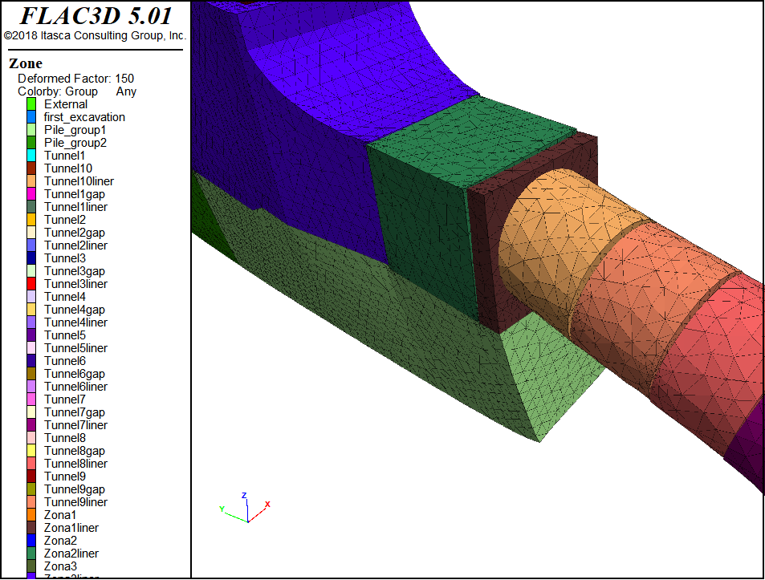
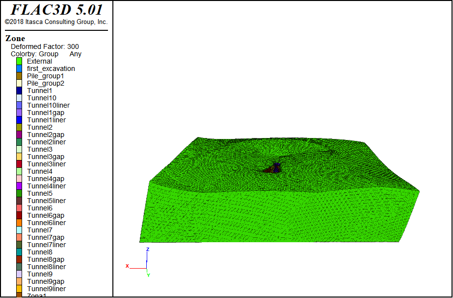
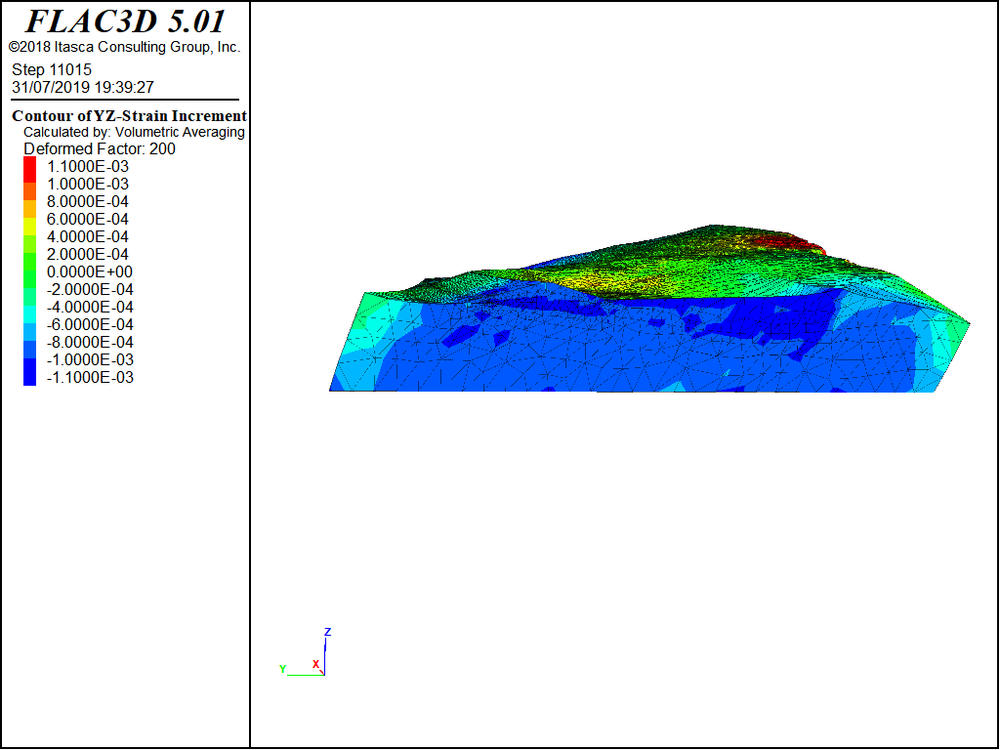

# grab_data_from_FLAC3D
This script is a complementary tool for a FLAC3D dynamic model developed for the assessment of tunnel and underground structures displacement during earthquake event.
It helps to convert and plot data from FLAC3D.

